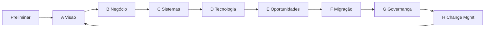

# Abordagem e método

O case pede visão de arquitetura, não um framework de prateleira. Usei o que reduz incerteza neste cenário e deixei o resto de fora.

## TOGAF ADM — o que foi percorrido

O ADM é o ciclo, não o entregável. A Fase A (Architecture Vision) é o centro do pedido. As fases seguintes aparecem só o suficiente para lastrear a visão e o plano de migração.

| Fase | Uso neste case | Artefato |
|------|----------------|----------|
| Preliminar | Princípios: microserviços permanecem; produto novo não cria silo; comprar commodity, construir diferenciação | Este documento + ADRs |
| A — Visão | Problema, escopo, stakeholders, AS-IS vs TO-BE, recomendação de produto | [00](00-sumario-executivo.md), [06](06-visao-as-is.md), [07](07-visao-to-be.md) |
| B — Negócio | Subdomínios, capacidades, cadeia e fluxos de valor, processos | [02](02-problemas-e-subdominios.md)–[05](05-cadeia-e-fluxos-de-valor.md), [10](10-processos-e-ddd.md) |
| C — Sistemas de informação | Building blocks, bounded contexts, serviços | [08](08-building-blocks-e-microservicos.md) |
| D — Tecnologia | Estilo, eventos, consistência do dinheiro | [07](07-visao-to-be.md), [ADR-003](decisoes/ADR-003-manter-microservicos.md) |
| E — Oportunidades | Conta vs cashback; buy vs build do core | ADRs 001 e 002 |
| F — Migração | Arquiteturas intermediárias T1–T4 | [09](09-roadmap-de-migracao.md) |
| G/H | Fora de escopo da visão; só o mínimo de governança (moratória de silo, catálogo) | [09](09-roadmap-de-migracao.md) |

Não abri Architecture Change Request, contrato de arquitetura formal nem catálogo TOGAF completo. Isso inflaria o pacote e não muda a decisão do C-level.

## Por que cada guia

| Guia | Motivo de uso | Motivo de não usar o resto |
|------|----------------|----------------------------|
| **TOGAF ADM** | O pedido é *Architecture Vision* + gap + migração. ADM dá a ordem: negócio antes de serviço, serviço antes de ferramenta. | Não adotei o metamodelo inteiro nem TOGAF por TOGAF. |
| **Capability-based planning** | O banco não tem mapa de capacidades; tem organograma de produtos. Capacidade é a unidade que sobrevive à troca de sistema. | Não fiz BIZBOK de ponta a ponta. |
| **Value chain / value stream** | O legado quebra a cadeia no elo *servir*. Sem isso, a discussão cai em feature vs feature. | Não modelei BPMN de todos os processos de crédito. |
| **DDD estratégico** | Subdomínio e bounded context explicam o silo melhor que “microsserviço”. Core / supporting / generic decide o que comprar. | Não inventei linguagem ubíqua de consultoria. A língua é a do banco. |
| **DDD tático** | Conta, lançamento e cliente são agregados com invariantes de dinheiro. Sem isso a decomposição vira CRUD. | Não desenhei todos os agregados do crédito legado. |
| **BIAN como referência, não como religião** | Ajuda a nomear Account, Payment Order, Current Account sem reinventar o dicionário. | Não vou implantar o BIAN Service Landscape. O banco não é um core vendor. |
| **Regulação brasileira** | Conta de pagamento (Lei 12.865/2013), PIX/SPI, PLD/CFT (Circular 3.978), LGPD, Resolução 4.658/CMN e sucessoras de cyber. Sem isso a visão é genérica. | Não é parecer jurídico. |
| **Strangler + ACL** | Único jeito de não reescrever CDC/cartão/consignado para lançar conta. | Big bang de core está descartado no ADR-002. |

## Princípios da Fase Preliminar

1. O estilo arquitetural vigente é **microserviços** e permanece.
2. Produto novo **não abre silo**. Entra no catálogo e consome cliente, ledger e pagamento.
3. **Comprar** o que é commodity regulado e operacional (trilho PIX, motor de ledger). **Construir** o que é identidade do banco (crédito, relacionamento, experiência da conta).
4. Dinheiro tem consistência própria: ledger e conta formam um núcleo apertado; o resto é eventual e por evento.
5. Arquitetura intermediária vale mais que alvo perfeito. Cada transição entrega capacidade usável.
6. Documentar para decidir. Se o artefato não muda uma decisão, não entra no pacote.

## Stakeholders e preocupações

| Stakeholder | Preocupação | Como a visão responde |
|-------------|-------------|------------------------|
| C-level | Engajamento e um produto só | Conta; cashback na alvo, não agora |
| CTO | Velocidade e “comprar core resolve?” | Core composável; T1/T2 em meses, não em programa de cinco anos |
| CIO | Risco de decisão sem arquitetura | Pacote com gap, ADRs e plano de migração |
| Risco / PLD | Conta aumenta superfície | KYC único e monitoramento no mesmo cliente |
| Produtos de crédito | Não parar a fábrica | Legado encapsulado; crédito só converge a partir de T3 |
| Operações | Dois mundos para sempre | T3 começa a aposentar adaptadores |

## Requisitos de arquitetura (Architecture Requirements)

Saíram do case, não de um workshop fictício:

- AR-01: Não alterar o estilo de microserviços.
- AR-02: Recomendar um produto, com justificativa.
- AR-03: Potencializar o que já é aderente; desenhar TO-BE só para o gap.
- AR-04: Tratar silo como restrição da cadeia de valor, não como dívida estética.
- AR-05: Lastrear decisão (capacidade, valor, building block, migração).
