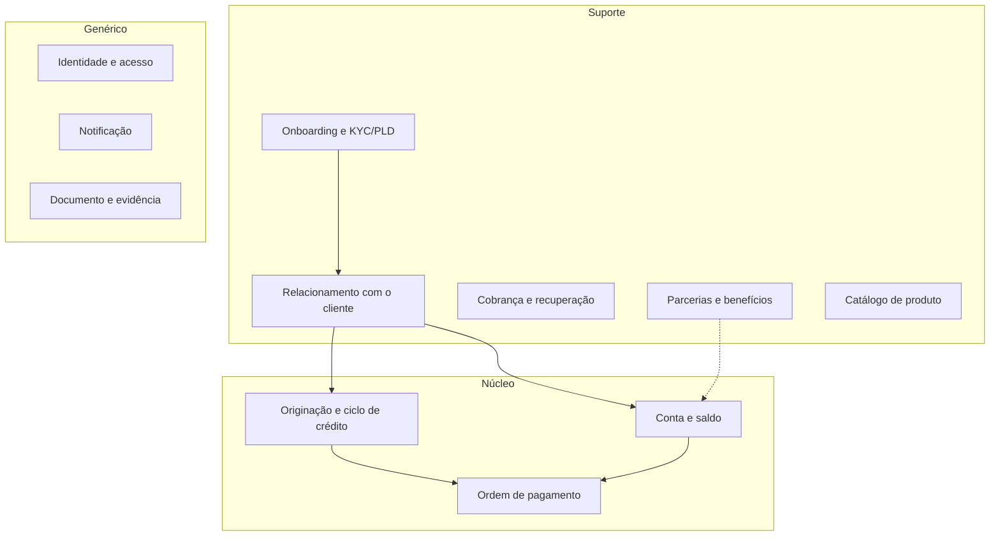
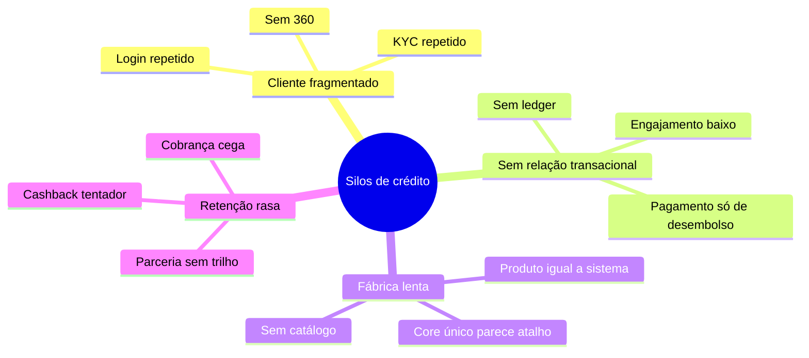

# Mapa de problemas de negócio e subdomínios

O banco não tem um problema de “falta de app”. Tem um problema de **fronteira de negócio**: cada produto de crédito é um negócio à parte, com cliente, contrato, desembolso e cobrança próprios. Isso explica o baixo reaproveitamento e o custo de lançar qualquer coisa nova — conta ou cashback.

## Subdomínios (DDD estratégico)

Classificação: **núcleo** (diferencia e gera margem), **suporte** (necessário e específico do banco), **genérico** (igual ao de qualquer instituição).

O núcleo **hoje** é só crédito. Conta e pagamento estão ausentes — e é exatamente por isso que o portfólio não engaja. Cashback (parcerias e benefícios) é suporte, não núcleo. Tratar suporte como primeiro produto é o erro clássico de quem lê o teste de mercado e ignora o mapa de subdomínios.

## Problemas por subdomínio

| ID | Subdomínio | Tipo | Problema | Efeito na cadeia | Se ignorar |
|----|------------|------|----------|------------------|------------|
| P-01 | Relacionamento com o cliente | Estrutural | Cinco cadastros, nenhum cliente | Originação e atendimento não se reconhecem | Conta e cashback nascem com o sexto cadastro |
| P-02 | Originação de crédito | Operacional / estrutural | Réplicas de motor, política e contrato | Time-to-market de produto = time-to-market de silo | “Plataforma” continua sendo slogan |
| P-03 | Desembolso / pagamento | Estrutural | Pagamento existe só como saída de empréstimo | Não há PIX de cliente, só TED/PIX de operação | Conta não tem trilho; cashback não tem lastro transacional |
| P-04 | Conta e saldo | Ausência | Não existe ledger de cliente | Não há relação diária nem opção de portabilidade de salário | Qualquer “conta” vira wrapper de terceiro sem dono de dado |
| P-05 | Cobrança | Operacional | Réplica por produto | Recuperação não vê a posição global do cliente | Conta pode ser usada para amortizar e ninguém enxerga |
| P-06 | Catálogo de produto | Estrutural | Produto = deploy | Não há composição (crédito em cima de conta) | Cada lançamento reabre o mesmo projeto |
| P-07 | Parcerias e benefícios | De oportunidade | Não existe; o teste de cashback puxou o tema | Retenção hoje é só refinanciamento | Priorizar agora cria silo de pontos |
| P-08 | Onboarding / KYC / PLD | Regulatório | KYC por produto, não por pessoa | Fricção e risco de PLD inconsistente | Conta amplia circulação e herda o furo |
| P-09 | Identidade | Genérico fragmentado | Login e sessão por canal/produto | Cliente “não existe” entre apps | Conta vira o sétimo login |
| P-10 | Dados / evento | Estrutural | Integração ponto a ponto entre silos | Qualquer interoperabilidade é projeto | Value stream de conta não conversa com crédito |

## Mapa de problemas (visão única)

## Leitura dos testes de mercado

Os testes disseram: o público **quer** conta e **quer** cashback. Os dois atacam engajamento. Só a conta ataca P-01, P-03, P-04, P-06 e P-10 ao mesmo tempo. Cashback ataca P-07 e, se for bem feito, um pedaço de retenção. Não mexe no restante.

Por isso a classificação de problema não é “qual feature pontuou no teste”. É “qual conjunto de problemas a arquitetura consegue pagar de uma vez só, sem criar o próximo silo”.

## Fronteiras que a visão respeita

- Crédito continua núcleo de margem. Nada aqui propõe reescrever consignado para lançar PIX.
- Conta entra como **núcleo novo**, não como feature do cartão.
- Parcerias ficam desenhadas no mapa para não sermos surpreendidos no T4, mas sem backlog de implementação agora.
- Genéricos (identidade, notificação, documento) saem dos produtos e viram plataforma — é o reaproveitamento que o case cobra.
