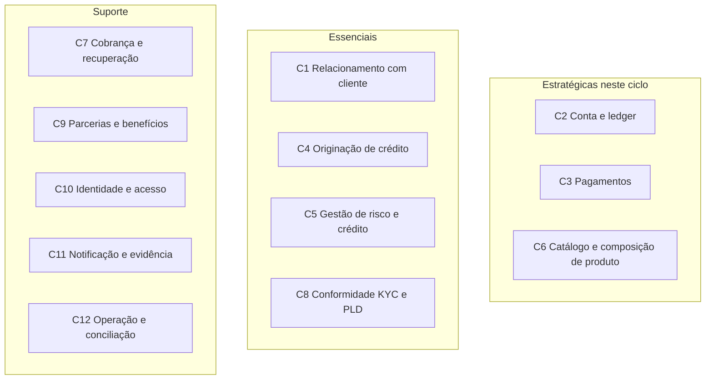

# Mapa de capacidades de negócio

Capacidade é o que o banco **é capaz de fazer**, independente do sistema que hoje segura o silo. Sem esse mapa, a conversa do CTO (“comprar core”) e a do C-level (“qual produto”) não se encontram.

## Classificação usada

Três eixos, de propósito distinto:

| Eixo | Valores | Para que serve |
|------|---------|----------------|
| **Papel** | Estratégica / Essencial / Suporte | Prioridade de investimento (TOGAF / capability planning) |
| **DDD** | Núcleo / Suporte / Genérico | Buy vs build e fronteira de contexto |
| **Aderência** | Aderente / Parcial / Não aderente | O que potencializar vs o que vai para o TO-BE |
| **Maturidade** | Ausente / Fragmentada / Adequada / Forte | Calor do AS-IS |

*Estratégica* aqui não é “importante”. É capacidade que **muda a posição competitiva neste ciclo** (engajamento + velocidade de produto). Crédito é essencial e lucrativo; não é a alavanca deste case.

## Capacidades top-level

## Catálogo e calor

| ID | Capacidade | Papel | DDD | Aderência | Maturidade | Dono proposto | Nota |
|----|------------|-------|-----|-----------|------------|---------------|------|
| C1 | Relacionamento com o cliente | Essencial | Suporte | Não aderente | Fragmentada | Plataforma | Cinco cadastros. Primeira pedra. |
| C2 | Conta e ledger | Estratégica | Núcleo | Não aderente | Ausente | Plataforma | Sem isso não existe o produto escolhido. |
| C3 | Pagamentos (PIX, TED, boleto) | Estratégica | Núcleo | Parcial | Fragmentada | Plataforma | Existe como desembolso, não como ordem do cliente. |
| C4 | Originação de crédito | Essencial | Núcleo | Aderente | Forte | Produtos | Potencializar. Não reescrever em T1/T2. |
| C5 | Risco e decisão de crédito | Essencial | Núcleo | Aderente | Forte | Risco | Aderente no silo; reuso vem depois. |
| C6 | Catálogo e composição de produto | Estratégica | Suporte | Não aderente | Ausente | Plataforma | Hoje produto = sistema. |
| C7 | Cobrança e recuperação | Suporte | Suporte | Parcial | Fragmentada | Operações | Converge em T3, quando houver posição única. |
| C8 | Conformidade, KYC e PLD | Essencial | Suporte | Parcial | Adequada | Compliance | Adequada para crédito; insuficiente para circulação. |
| C9 | Parcerias e benefícios | Suporte | Suporte | Não aderente | Ausente | Produtos | Casa do cashback. T4. |
| C10 | Identidade e acesso | Suporte | Genérico | Parcial | Fragmentada | Plataforma | Sai dos produtos. |
| C11 | Notificação e evidência | Suporte | Genérico | Parcial | Fragmentada | Plataforma | Idem. |
| C12 | Operação, liquidação e conciliação | Suporte | Suporte | Parcial | Adequada | Operações | Forte no desembolso; fraca no PIX de cliente. |

## Mapa de calor (AS-IS → alvo T2)

| Capacidade | AS-IS | Alvo após T2 | Movimento |
|------------|-------|--------------|-----------|
| C1 Cliente | Fragmentada | Adequada | Consolidar |
| C2 Conta e ledger | Ausente | Adequada | Construir / comprar motor |
| C3 Pagamentos | Fragmentada | Adequada (PIX in/out) | Elevar desembolso a ordem |
| C4 Originação | Forte | Forte | Manter |
| C5 Risco | Forte | Forte | Manter |
| C6 Catálogo | Ausente | Parcial | Nascer com a conta |
| C7 Cobrança | Fragmentada | Fragmentada | Sem investimento de plataforma ainda |
| C8 KYC/PLD | Adequada | Adequada + circulação | Estender, não refazer |
| C9 Parcerias | Ausente | Ausente (desenhada) | Explicitamente adiada |
| C10 Identidade | Fragmentada | Adequada | Plataforma |
| C11 Notificação | Fragmentada | Adequada | Plataforma |
| C12 Conciliação | Adequada | Adequada + SPI | Estender |

## Nível 2 — só onde a decisão muda

Não explode o mapa inteiro. Detalho o que a conta exige.

**C2 Conta e ledger**
- C2.1 Abrir, bloquear, encerrar conta de pagamento
- C2.2 Manter plano de contas / posições
- C2.3 Lançar, estornar, consultar saldo com invariante de partidas
- C2.4 Extrato e posição do dia

**C3 Pagamentos**
- C3.1 Aceitar ordem do cliente (PIX)
- C3.2 Liquidar via SPI / agente de liquidação
- C3.3 Desembolso de crédito (já existe; vira um tipo de ordem)
- C3.4 Conciliação e devolução

**C1 Cliente**
- C1.1 Identidade de pessoa (CPF) canônica
- C1.2 Vínculo pessoa–produto
- C1.3 Consentimento e preferência de contato

## O que a classificação proíbe

- Tratar C9 (cashback) como estratégica neste ciclo. É suporte sem trilho.
- Tratar C4 como gap. Não é. Reescrever crédito para “aproveitar o core novo” é o caminho caro que o ADR-002 recusa.
- Comprar um core que entregue C4+C5+C2+C3 num bloco só. Isso mistura aderente com não aderente e joga fora o estilo que o case mandou preservar.
