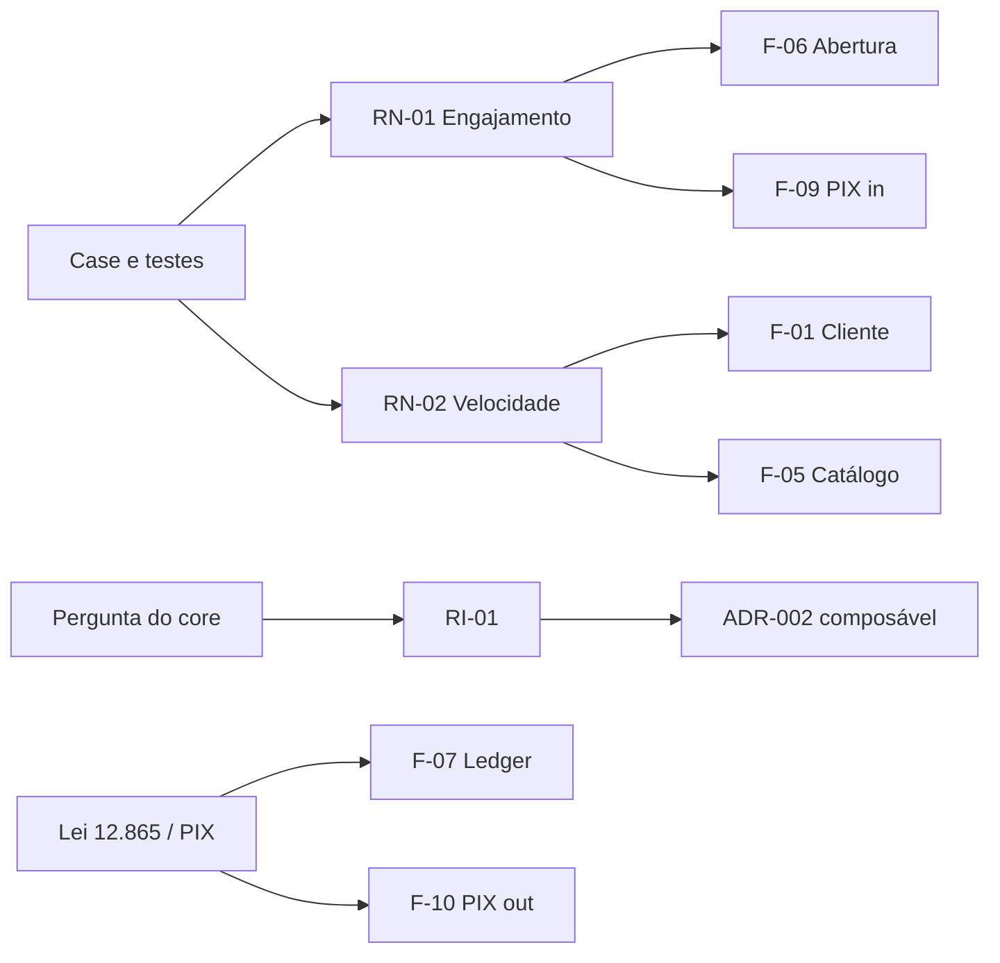

# Requisitos e funcionalidades

Requisito aqui é afirmação lastreada no case, no regulatório mínimo de conta/PIX ou no gap de capacidade. Não é lista de user story de discovery.

## Classificação

| Eixo | Valores |
|------|---------|
| **Tipo** | Negócio / Parte interessada / Arquitetural / Regulatório / Qualidade |
| **MoSCoW** | M (T2) / S (T3) / C (T4) / W (fora) |
| **Origem** | Case / C-level / CTO / CIO / Regulador / Análise EA |
| **Capacidade** | C1–C12 |

## Requisitos

| ID | Requisito | Tipo | MoSCoW | Origem | Cap. | Lastro |
|----|-----------|------|--------|--------|------|--------|
| RN-01 | Aumentar engajamento com um produto novo, não dois em paralelo | Negócio | M | C-level | C2 | Case: priorizar um |
| RN-02 | O produto escolhido deve acelerar o próximo lançamento | Negócio | M | C-level | C6 | Case: expectativa de arquitetura |
| RN-03 | Manter a fábrica de crédito no ar | Negócio | M | Produtos | C4 | Portfólio atual é a margem |
| RN-04 | Evitar sexto silo | Negócio | M | Análise EA | C1, C6 | Case: silos sem reaproveitamento |
| RI-01 | CTO quer saber se compra core | Parte interessada | M | CTO | C2, C3 | Resposta no ADR-002 |
| RI-02 | CIO exige visão antes da compra | Parte interessada | M | CIO | — | Este pacote |
| RA-01 | Estilo microserviços permanece | Arquitetural | M | Case | — | AR-01 |
| RA-02 | Integração por evento e contrato, não por banco compartilhado | Arquitetural | M | Análise EA | C1, C2, C3 | Evita o “core escondido” |
| RA-03 | Legado de crédito acessado por ACL / adaptador | Arquitetural | M | Análise EA | C4 | Strangler |
| RA-04 | Ledger com invariante de partidas dobradas no agregado | Arquitetural | M | Análise EA | C2 | Dinheiro |
| RR-01 | Conta de pagamento nos limites da Lei 12.865 e regras Bacen aplicáveis ao tipo societário do banco | Regulatório | M | Regulador | C2, C8 | Produto escolhido |
| RR-02 | PIX via SPI (direto ou indireto) com rastreio de ordem | Regulatório | M | Regulador | C3 | Engajamento real da conta |
| RR-03 | KYC/PLD na pessoa, não no produto | Regulatório | M | Regulador | C8 | Circular 3.978 e sucessoras |
| RR-04 | LGPD: base legal e finalidade no cliente canônico | Regulatório | M | Regulador | C1 | Cadastro único |
| RQ-01 | Abertura de conta em minutos no caminho feliz, com trilha de auditoria | Qualidade | M | Análise EA | C2, C8 | Engajamento |
| RQ-02 | Saldo consistente na falha de um serviço satélite | Qualidade | M | Análise EA | C2 | Núcleo apertado |
| RQ-03 | Novo produto de catálogo sem novo cadastro de pessoa | Qualidade | S | C-level | C1, C6 | Aceleração |
| RN-05 | Cashback com parceiros no futuro, no mesmo cliente e ledger | Negócio | C | C-level / teste | C9 | Não agora |
| RN-06 | TED, boleto e cartão débito na conta | Negócio | S | Análise EA | C3 | Depois do PIX |
| RW-01 | Substituir os núcleos de CDC/cartão/consignado neste ciclo | Negócio | W | CTO (implícito) | C4 | Recusado |

## Funcionalidades que emergem do levantamento

Não foram “inventadas de app”. Cada uma fecha um requisito e uma capacidade.

| ID | Funcionalidade | Requisitos | Cap. | Onda | Interopera com |
|----|----------------|------------|------|------|----------------|
| F-01 | Cadastro canônico de pessoa (CPF) e vínculo de produtos | RN-04, RR-04, RQ-03 | C1 | T1 | C8, C10, C4 |
| F-02 | Onboarding / KYC reutilizável (prova de vida, política PLD) | RR-03, RQ-01 | C8 | T1 | C1 |
| F-03 | Identidade única de canal | P-09, C10 | C10 | T1 | C1 |
| F-04 | Barramento de eventos de domínio (PessoaCriada, ContaAberta, OrdemLiquidada) | RA-02, P-10 | — | T1 | todos |
| F-05 | Catálogo: produto Conta Pagamento publicado | RN-02, C6 | C6 | T1 | C2 |
| F-06 | Abertura de conta de pagamento (saga) | RN-01, RR-01, RQ-01 | C2 | T2 | C1, C8, C11 |
| F-07 | Ledger: crédito, débito, estorno, saldo | RA-04, RQ-02 | C2 | T2 | C3 |
| F-08 | Extrato e posição do dia | RN-01 | C2 | T2 | C11 |
| F-09 | PIX in (receber) | RR-02, RN-01 | C3 | T2 | C2, C12 |
| F-10 | PIX out (pagar) | RR-02, RN-01 | C3 | T2 | C2, C8, C12 |
| F-11 | Notificação de movimento | C11 | C11 | T2 | C2, C3 |
| F-12 | Adaptadores de leitura do crédito legado (posição, contrato) | RN-03, RA-03 | C4 | T2 | C1 |
| F-13 | Desembolso de crédito como ordem de pagamento | C3.3, RN-03 | C3, C4 | T3 | C2 |
| F-14 | Originação de crédito consumindo cliente e, se houver, saldo | RQ-03 | C4, C1 | T3 | C2 |
| F-15 | TED / boleto na conta | RN-06 | C3 | T3 | C2 |
| F-16 | Motor de benefício / cashback sobre lançamento | RN-05 | C9 | T4 | C2, C3 |
| F-17 | Acordo com parceiro e liquidação de rebate | RN-05 | C9 | T4 | C12 |

## O que explicitamente não emerge agora

- App de pontos independente, com saldo de moeda própria sem passar pelo ledger da conta.
- Marketplace de parceiros como produto de entrada.
- Substituição do motor de consignado ou do autorizador de cartão.
- Open Finance como produto. A conta deixa o banco *pronto* para o trilho; não é o escopo de T2.

## Rastreio resumido

A cadeia completa de valor e a ordem em que essas funcionalidades se encostam estão em [05](05-cadeia-e-fluxos-de-valor.md).
