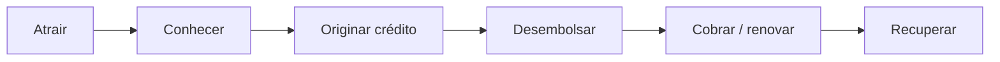
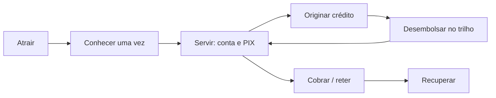
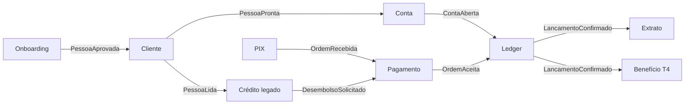

# Cadeia de valor e fluxos de valor

O silo não é um problema de diagrama de containers. É um problema de **cadeia**: o banco sabe *originar e cobrar* e quase não *serve* o cliente no dia a dia. Engajamento mora nesse elo que falta.

## Cadeia de valor (agrupamento funcional)

Adaptação da cadeia primária de um banco de varejo de crédito. Atividades de suporte embaixo.

**AS-IS — o que de fato existe**

| Elo | Agrupamento funcional | Como está | Dor |
|-----|----------------------|-----------|-----|
| Atrair | Marketing, parcerias de originação, loja | Existe por produto | CAC alto, sem motivo para ficar |
| Conhecer | Cadastro, KYC | Por produto | P-01, P-08 |
| Originar crédito | Política, análise, contrato | Forte e silado | Aderente, sem reuso |
| Desembolsar | TES/PIX operacional | Existe como retaguarda | Não é pagamento de cliente |
| Servir / transacionar | Conta, PIX, saldo | **Ausente** | Sem engajamento |
| Cobrar / renovar | Parcelas, refinanciamento | Por produto | Cego à posição global |
| Recuperar | Cobrança extraordinária | Por produto | Idem |

O elo que o case está pedindo, sem usar esse nome, é **Servir**. Conta de pagamentos *é* esse elo. Cashback é um enfeite do elo *Renovar*, e só funciona se já houver transação ou fatura para lastrear o ponto.

**TO-BE — cadeia com conta no meio**

Agrupamentos funcionais no alvo:

| Agrupamento | Capacidades | Sistemas / contextos |
|-------------|-------------|----------------------|
| Relacionar | C1, C8, C10 | Cliente, Onboarding, Identidade |
| Servir | C2, C3, C11, C12 | Conta, Ledger, Pagamento, PIX |
| Creditar | C4, C5 | Contextos de crédito (legado + ACL) |
| Cobrar e reter | C7, C9 | Cobrança; Benefício só em T4 |
| Governar produto | C6 | Catálogo |

## Fluxos de valor

Value stream é o caminho do cliente até um resultado. Abaixo, só os que a decisão exige. Interoperabilidade = eventos e serviços entre funcionalidades.

### VS-01 Abrir conta de pagamento (T2)

**Resultado:** pessoa conhecida, conta ativa, saldo zero, pronta para PIX.

| Etapa | Funcionalidade | Contexto | Evento publicado |
|-------|----------------|----------|------------------|
| Identificar | F-03 | Identidade | SessaoAutenticada |
| Conhecer | F-01, F-02 | Cliente, Onboarding | PessoaAprovada |
| Contratar | F-05, F-06 | Catálogo, Conta | ContaAberta |
| Provisionar | F-07 | Ledger | PosicaoCriada |
| Avisar | F-11 | Notificação | — |

Falha de KYC não cria conta. Falha de ledger depois de `ContaAberta` dispara compensação da saga (encerra a conta em abertura). Crédito legado **não entra** neste stream.

### VS-02 Receber PIX (T2)

**Resultado:** dinheiro do pagador na posição do cliente.

| Etapa | Funcionalidade | Contexto | Evento |
|-------|----------------|----------|--------|
| Receber ordem SPI | F-09 | PIX / Pagamento | OrdemRecebida |
| Validar conta destino | F-06 | Conta | — |
| Lançar | F-07 | Ledger | LancamentoConfirmado |
| Extrato / aviso | F-08, F-11 | Conta, Notificação | — |
| Conciliar | C12 | Operação | OrdemLiquidada |

### VS-03 Pagar PIX (T2)

Mesma nervura de VS-02, no sentido inverso, com PLD de saída (C8) **antes** do lançamento. Sem saldo, a ordem recusa. Não há “saldo negativo escondido no cartão”.

### VS-04 Contratar crédito já sendo cliente da conta (T3)

**Resultado:** contrato de crédito no produto legado, desembolso via ordem no trilho comum.

| Etapa | Funcionalidade | Interoperabilidade |
|-------|----------------|--------------------|
| Reusar pessoa | F-01, F-12 | Cliente → ACL crédito |
| Originar no silo (ainda) | C4 | Motor atual permanece |
| Desembolsar | F-13 | Crédito publica `DesembolsoSolicitado`; Pagamento/Ledger executam |
| Servir | F-08 | Cliente vê entrada na conta |

Este stream é o primeiro ganho visível de *aceleração*: a originação deixa de inventar um pagamento.

### VS-05 Acumular benefício em transação (T4, desenhado)

Lançamento confirmado → regra de parceria → crédito de benefício (no ledger, conta de passivo de campanha, **não** moeda paralela) → liquidação com parceiro. Sem VS-02/VS-03, este stream não tem lastro. Por isso cashback não é T2.

## Interoperabilidade entre funcionalidades

Contrato: evento de domínio versionado, sem tabela compartilhada. Quem precisa de consistência imediata (Pagamento → Ledger) chama API síncrona **dentro do núcleo**; o resto reage.

## Por que cashback perde neste recorte de valor

Cashback só aparece com robustez em VS-05. VS-05 depende de VS-02/03. VS-02/03 dependem de C2/C3. C2/C3 são o produto Conta. Começar por C9 é começar o filme pelo crédito final.
