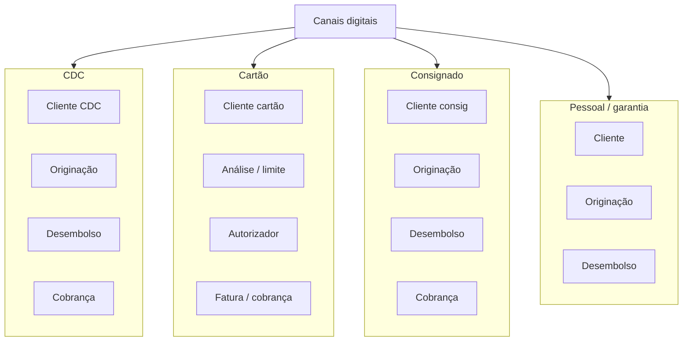

# Visão AS-IS

Arquitetura vigente, no nível que a Fase A precisa: o suficiente para marcar aderência e gap. Não é CMDB.

## Estilo e realidade

O banco já fala microserviços. Na prática, cada produto de crédito é um **cluster isolado** que se comporta como monólito distribuído daquele produto: cadastro, análise, contrato, desembolso e cobrança no mesmo recorte de time e de dado. O estilo declarado é aderente. O recorte de fronteira não é.

Integração típica: ponto a ponto, arquivo, ou “vamos no banco do outro produto”. Não há cliente canônico. Não há ledger de pessoa. PIX, quando existe, é ferramenta de tesouraria.

## O que está aderente à referência (potencializar)

Referência deste banco = microserviços + produtos de crédito como domínio de margem + canais digitais já testados com o público.

| Elemento | Por que é aderente | Como potencializar |
|----------|--------------------|--------------------|
| Estilo de implantação em serviços | Case manda manter | Usar o mesmo estilo na plataforma, não no silo |
| Capacidades C4 e C5 | Fábrica de crédito madura | Encapsular, não reescrever |
| Canais | Testes de conta e cashback já rodaram | Viram canal da plataforma, não do produto |
| Operação de desembolso | C12 parcial | Promover a *ordem de pagamento* |
| Consciência de PLD no crédito | C8 adequada no recorte atual | Estender à circulação |

## O que não está aderente (vai para o TO-BE)

| Gap | Evidência | Risco se o produto novo ignorar |
|-----|-----------|---------------------------------|
| Sem bounded context de Cliente | Cadastro por silo | Sexto cadastro |
| Sem contexto de Conta/Ledger | Produto inexistente | Conta “de fachada” em processadora |
| Pagamento não é capacidade | Só saída de empréstimo | PIX do cliente não tem dono |
| Sem catálogo | Produto = repositório git | Sem composição |
| Sem evento de domínio | Acoplamento ponto a ponto | Value streams não fecham |
| Identidade fragmentada | Login por canal | Fricção no onboarding da conta |

## Estilos em jogo no AS-IS

| Estilo | Presente? | Impacto da Visão |
|--------|-----------|------------------|
| Microserviços (declarado) | Sim, por produto | Permanece; muda o *recorte* |
| Monólito por produto | De fato, sim | Strangler; não big bang |
| Integração ponto a ponto | Sim | Substitui por evento + ACL |
| ESB corporativo | Não visto / não desejado | Continua fora |
| Core bancário único | Não | Não introduzimos um |

## Implicação para as duas opções de produto

**Conta em cima do AS-IS puro:** ou se compra uma processadora e aceita não ter o dado, ou se cria o sexto silo. Os dois ferem RN-02.

**Cashback em cima do AS-IS puro:** um serviço de pontos plugged no cartão ou no CDC. Engajamento de campanha, zero efeito em C1–C3, e o CTO continua sem resposta para o core.

A visão AS-IS, sozinha, já elimina “lançar o produto no silo atual” como opção séria. O TO-BE existe para abrir a conta **sem** fingir que o crédito vai ser reescrito no mesmo semestre.
