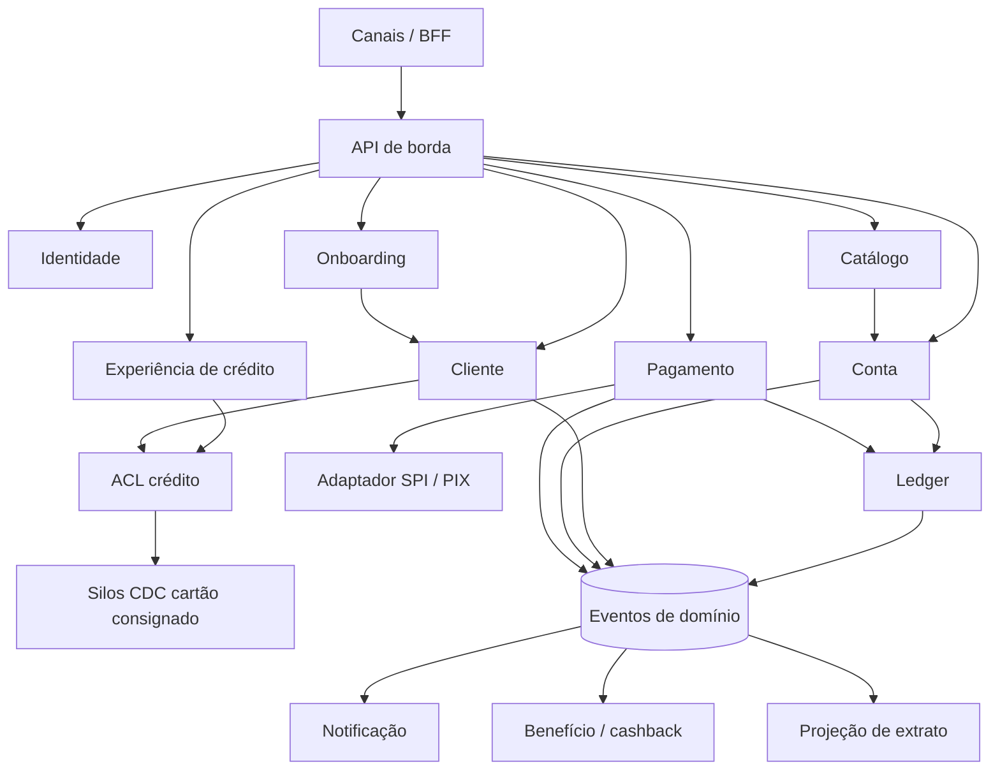
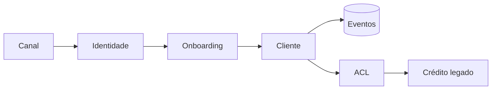

# Visão TO-BE e arquiteturas intermediárias

O alvo não é “um core”. É uma **plataforma de capacidades** com produtos em volta. O caminho até lá é tão importante quanto o desenho final: o crédito não pode parar.

## Arquitetura alvo (T4)

**Estilos no alvo** (os que a Fase A realmente mexe):

| Estilo | Decisão | Por quê |
|--------|---------|---------|
| Microserviços por bounded context | Manter e corrigir o recorte | Pedido do case; alinha com DDD |
| Event-driven | Complementar, não substituir | Interoperabilidade dos value streams |
| API-led / BFF | Canais finos | Evita cada app falar com oito serviços |
| Núcleo síncrono Conta–Ledger–Pagamento | Exceção consciente | Invariante de dinheiro |
| Strangler + ACL | Permanecer enquanto houver silo | RN-03 |
| Modular monolith bancário | Recusado no perímetro do banco | Volta ao core único |
| ESB | Recusado | Centro de gravidade errado |
| BaaS / motor commodity | Seletivo, atrás de porta | ADR-002 |

## Arquiteturas intermediárias

TOGAF chama de transition architectures. Aqui são estados *operáveis*, não slides.

### T0 — Baseline

O AS-IS. Sem conta, sem cliente canônico. Fábrica de crédito no ar.

### T1 — Plataforma de pessoa e evento

**Entra em produção:** Identidade, Cliente, Onboarding/KYC reutilizável, catálogo (ainda só com produtos de crédito *referenciados*), barramento de eventos.  
**Não entra:** ledger, PIX de cliente.  
**Crédito:** continua no silo; passa a *ler* pessoa via ACL (opcional, começando por um produto piloto).  
**Valor já entregue:** fim do sexto cadastro; moratória de silo vira regra técnica, não cartaz.

### T2 — Conta de pagamentos mínima viável

**Entra:** Conta, Ledger, Pagamento, adaptador PIX, extrato, notificação de movimento.  
**Produto publicado no catálogo:** Conta de Pagamento.  
**Value streams:** VS-01, VS-02, VS-03.  
**Crédito:** adaptador de leitura (F-12). Sem reescrita.  
**Compra permitida:** motor de ledger e/ou conexão SPI, atrás da porta do contexto Pagamento/Ledger.  
Este é o primeiro estado em que o C-level vê o produto que escolheu.

### T3 — Crédito no trilho

**Entra:** desembolso como ordem (F-13); um produto de crédito (o de menor acoplamento interno) origina já com cliente canônico; TED/boleto se o negócio pedir.  
**Sai, aos poucos:** arquivos de desembolso daquele produto.  
**Ainda não:** reescrita de cartão/autorizador.

### T4 — Alvo

**Entra:** C9 Benefício sobre `LancamentoConfirmado`; segundo e terceiro produtos de crédito no trilho; aposentadoria dos adaptadores que não tiverem mais justificativa.  
Cashback nasce aqui, ou não nasce — a arquitetura já não depende dessa decisão para fazer sentido.

## Building blocks no tempo

| Bloco | T1 | T2 | T3 | T4 |
|-------|----|----|----|----|
| Identidade, Cliente, Onboarding | SBB próprio | — | — | — |
| Catálogo | SBB próprio (mínimo) | Produto Conta | Produtos compostos | Benefício como produto |
| Conta + Ledger | — | SBB próprio ou motor comprado | — | — |
| Pagamento + PIX | — | SBB + adaptador | TED/boleto | — |
| ACL crédito | Leitura piloto | Leitura ampla | Escrita de desembolso | Encolhe |
| Benefício | — | Contrato de evento reservado | — | SBB |

## Critérios de passagem de onda

Não avançar de T1 → T2 se pessoa ainda puder nascer fora do contexto Cliente.  
Não avançar de T2 → T3 se saldo puder divergir entre Conta e Ledger.  
Não abrir T4 se `LancamentoConfirmado` não for o único lastro possível de benefício — senão o cashback vira moeda paralela.

## O que a visão recusa no TO-BE

- Conta white-label sem ledger próprio (o banco não fica com o building block).
- “Data lake como cliente 360”. Cliente 360 é contexto transacional, não relatório.
- Event sourcing em tudo. Ledger pode usar log de lançamentos; o resto não precisa.
- Um BFF por produto de crédito eterno. Canal é da plataforma.
