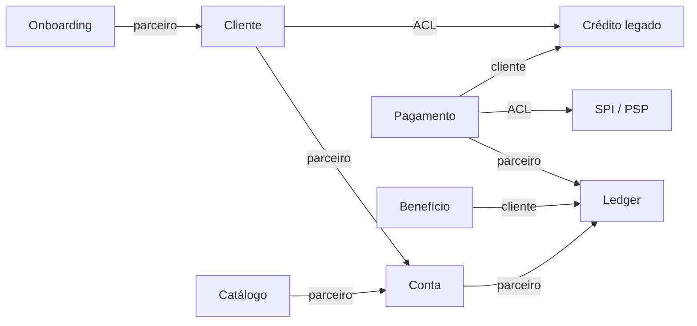

# Building blocks e decomposição de microserviços

TOGAF distingue **ABB** (o que a arquitetura precisa ser capaz de oferecer) e **SBB** (o que de fato implementa). Sem essa distinção, “comprar o core” e “criar o serviço X” parecem a mesma decisão.

## Architecture Building Blocks

| ABB | Capacidades | Papel | Comprável? |
|-----|-------------|-------|------------|
| ABB-Cliente | C1, parte de C8 | Essencial | Não como produto fechado. Dado é do banco. |
| ABB-Conta | C2 | Estratégico | A *fachada* não. O motor de lançamento, sim. |
| ABB-Pagamento | C3, C12 | Estratégico | Conexão SPI / PSP, sim. Ordem, não. |
| ABB-Credito | C4, C5, C7 | Essencial | Já existe no legado. Não recomprar. |
| ABB-Catalogo | C6 | Estratégico | Construir. É pouco código e muita disciplina. |
| ABB-Identidade | C10 | Suporte / genérico | IdP de mercado. |
| ABB-Notificacao | C11 | Genérico | Provedor de canal. |
| ABB-Beneficio | C9 | Suporte | T4. Motor de campanha comprável; regra de lastro, não. |

## Solution Building Blocks (T2)

| SBB | Implementa | Tipo | Notas |
|-----|------------|------|-------|
| `identity-service` | ABB-Identidade | Build + IdP | Genérico |
| `onboarding-service` | parte de ABB-Cliente | Build | Políticas KYC do banco |
| `customer-service` | ABB-Cliente | Build | Agregado Pessoa |
| `product-catalog-service` | ABB-Catalogo | Build | |
| `account-service` | ABB-Conta (ciclo de vida) | Build | Não mistura lançamento |
| `ledger-service` | ABB-Conta (posições) | Build ou motor | Único escritor de saldo |
| `payment-order-service` | ABB-Pagamento | Build | |
| `pix-adapter` | ABB-Pagamento | Buy + ACL | Troca de PSP sem trocar ordem |
| `notification-service` | ABB-Notificacao | Build fino | |
| `credit-legacy-acl` | ABB-Credito (porta) | Build | Anticorrupção |
| clusters CDC / cartão / consignado | ABB-Credito | Legado | Intocáveis em T1/T2 |

## Padrões de decomposição (os que valem aqui)

Usei três padrões. Recusei os outros de propósito.

**1. Por subdomínio / bounded context**  
Cliente não vive dentro de Conta. Conta não vive dentro de PIX. Benefício não vive dentro de Cartão. É o padrão que ataca o silo.

**2. Por capacidade de negócio**  
Pagamento é capacidade, não “o microsserviço do Banco Central”. O adaptador PIX é SBB de borda, não o dono da ordem.

**3. Núcleo transacional apertado**  
`account-service`, `ledger-service` e `payment-order-service` se falam de forma síncrona e têm o mesmo dono de SRE. Não é monólito. É reconhecimento de que saldo não é eventual.

**Recusados**

| Padrão | Por que não |
|--------|-------------|
| Um serviço por tabela | Volta CRUD e mata invariante |
| Decomposição por camada (serviço de “business”, serviço de “dao”) | É o silo com outro nome |
| Um serviço por tela do app | Canal não é contexto |
| “Database per product” como está hoje | É o problema |
| Core vendor = um SBB só | Viola AR-01 e mistura ABBs |

## Mapa de contextos (estratégico)

Relação *parceiro*: contratos estáveis, times que se conhecem.  
*Cliente* (no sentido DDD): Benefício e Crédito dependem do ledger/pagamento, não o contrário.  
*ACL*: crédito e PIX são modelos alheios. Nunca vazam tipo de fornecedor para dentro do domínio.

## Tática (agregados que importam)

Só os invariantes que, se errarem, o banco perde dinheiro ou licença.

| Contexto | Agregado | Invariante | Comandos |
|----------|----------|------------|----------|
| Cliente | `Pessoa` | Um CPF ativo. Produtos são vínculos, não cópias de cadastro | Registrar, atualizar, vincularProduto |
| Onboarding | `DossieKyc` | Não aprova sem política PLD do momento | Iniciar, decidir |
| Conta | `ContaPagamento` | Só existe com Pessoa aprovada e produto do catálogo. Estados: em_abertura, ativa, bloqueada, encerrada | Abrir, bloquear, encerrar |
| Ledger | `ContaContabil` + `Lancamento` | Partidas dobradas. Saldo não fica negativo em conta de pagamento de varejo | Lançar, estornar |
| Pagamento | `OrdemPagamento` | Transita solicitado → autorizado → liquidado / recusado / devolvido. Sem liquidação sem lançamento | Solicitar, autorizar, liquidar |
| Catálogo | `Produto` | ContaPagamento é um produto publicável | Publicar, descontinuar |
| Benefício (T4) | `RegraCampanha` | Só dispara em `LancamentoConfirmado` | — |

Saga de abertura (VS-01): orquestração curta em `account-service`. Compensação: encerrar `em_abertura` se o ledger não provisionar. Sem 2PC distribuído.

Outbox no ledger e no pagamento: o evento `LancamentoConfirmado` / `OrdemLiquidada` só existe se o commit local existiu.

## Qualidade do recorte

Um time consegue explicar o serviço sem abrir o código do vizinho. Trocar o `pix-adapter` não mexe em `Pessoa`. Reescrever consignado não mexe em `Lancamento`. Se isso não for verdade, a fronteira está errada — e é exatamente o teste que o silo atual falha.
