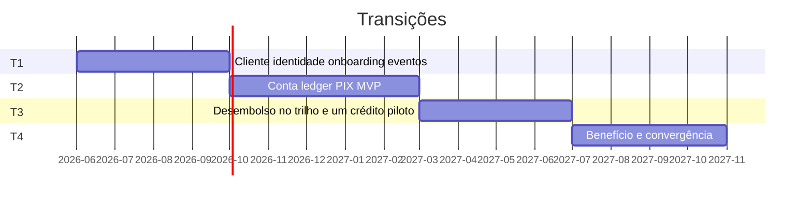

# Roadmap de migração

Como a arquitetura sai do silo sem desligar a fábrica de crédito. Cada onda entrega capacidade em produção. Data é ordem, não cronograma de fornecedor.

## Princípio da migração

Strangler em volta do crédito. Plataforma nasce do lado. Produto novo (conta) só nasce na plataforma. Nada de “projeto core” que pede freeze de seis meses.

## Ondas

Os meses são ilustrativos a partir de uma aprovação em 2026. O que importa é a dependência: T2 não começa de verdade sem Cliente canônico; T4 não começa sem `LancamentoConfirmado`.

## T1 — fundação (obrigatória antes da conta)

| Trabalho | Sai de | Entra |
|----------|--------|-------|
| Pessoa canônica + migração assistida de chaves dos silos | Cadastros locais como *fonte* | `customer-service` como fonte; silo vira cópia |
| KYC reutilizável | Fluxo por produto | `onboarding-service` |
| IdP único | Logins locais | ABB-Identidade |
| Eventos | Ponto a ponto novo | Tópico de domínio versionado |
| Governança | — | Moratória: repositório novo de produto não abre cadastro próprio |

**Pronto quando:** uma pessoa existe uma vez e um produto de crédito piloto consegue lê-la via ACL sem copiar ficha.

## T2 — produto (a entrega que o C-level comprou)

| Trabalho | Decisão |
|----------|---------|
| RFI de motor de ledger e de conexão SPI | Comprar SBB commodity, não ABB inteiro |
| `account` + `ledger` + `payment-order` + `pix-adapter` | Núcleo apertado |
| VS-01, VS-02, VS-03 em produção | Conta de verdade |
| Extrato e notificação | Relação diária |
| Runbook PLD de circulação | C8 estendido |

**Pronto quando:** cliente abre conta, recebe e envia PIX, saldo bate com o SPI no D+0/D+1 da conciliação. Crédito segue intacto.

## T3 — o crédito começa a pagar o investimento

| Trabalho | Decisão |
|----------|---------|
| Escolher **um** produto de crédito (recomendado: crédito pessoal, menor malha) | Evitar cartão e consignado no primeiro corte |
| Desembolso vira `OrdemPagamento` | Aposenta arquivo daquele produto |
| TED/boleto se o negócio exigir para salário / contas | Não é obrigatório para declarar T3 |

**Pronto quando:** um desembolso de crédito cai na conta do próprio banco sem integração especial da tesouraria.

## T4 — retenção, inclusive cashback

Só se T2 estiver estável. Motor de campanha pode ser comprado. Lastro é lançamento. Parceiro não recebe dump de cliente: recebe evento mínimo e liquidação.

## Governança mínima (Fase G, sem teatro)

- Architecture board quinzenal nas ondas T1/T2. Pauta: exceção à moratória de silo e compra de SBB.
- Catálogo é a lista oficial de produtos. O que não está lá não vai a canal.
- ACL tem dono. Sem dono, o legado vaza de volta para o domínio.
- Indicadores: % de pessoas só no `customer-service`; tempo de abertura de conta; divergências ledger vs SPI; número de cadastros novos abertos em silo (meta: zero).

## Riscos e resposta

| Risco | Onda | Resposta |
|-------|------|----------|
| RFI de ledger virar RFP de core | T2 | Escopo do RFI no ADR-002; board recusa pacote “crédito+conta” |
| Time de crédito ignorar Cliente | T1 | Piloto obrigatório num produto; sem isso T2 não abre canal |
| PSP no centro do desenho | T2 | `pix-adapter` é SBB trocável |
| Pressão por cashback no meio de T2 | T2 | C9 é T4; campanha comercial usa o que o crédito já tem, fora da plataforma |
| Dual run eterno | T3+ | Cada adaptador tem data de encolhimento no board |

## O que não está no plano

Replataforma do autorizador de cartão. Data lake como fonte de cliente. Migração “big bang” de todos os contratos de crédito. Compra de Temenos/BaNCS/GFT como programa desta visão.
